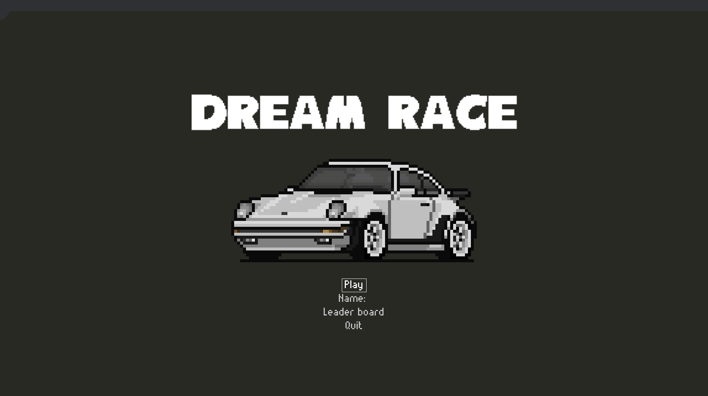
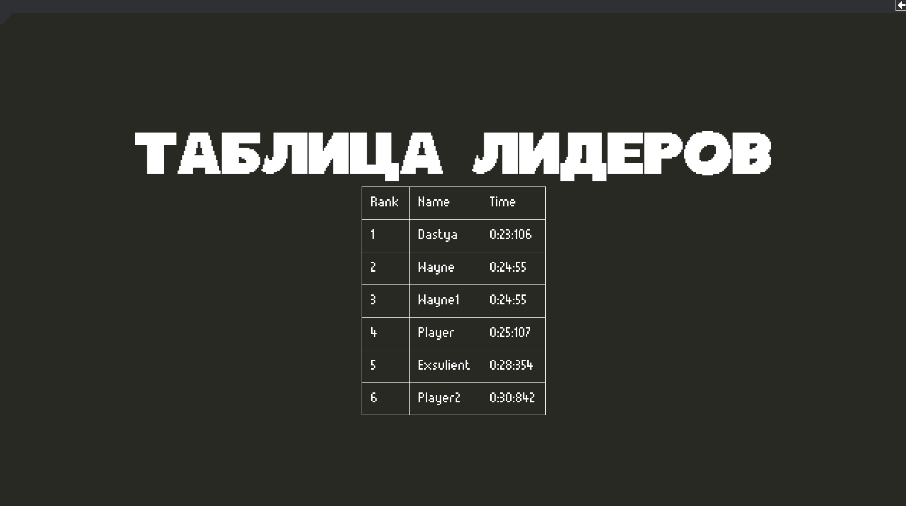
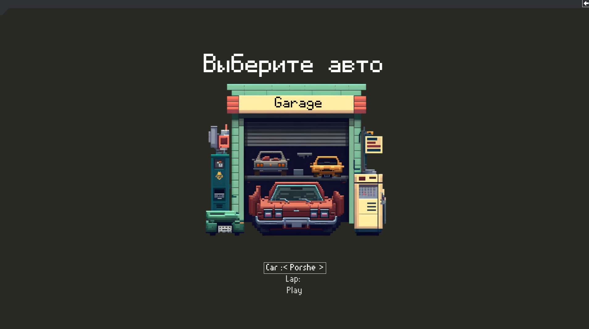
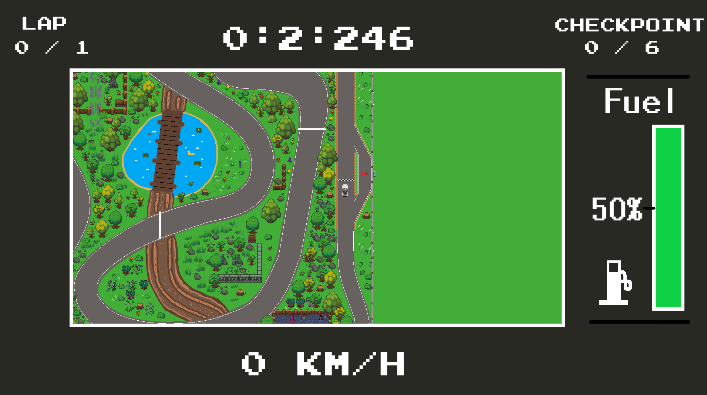
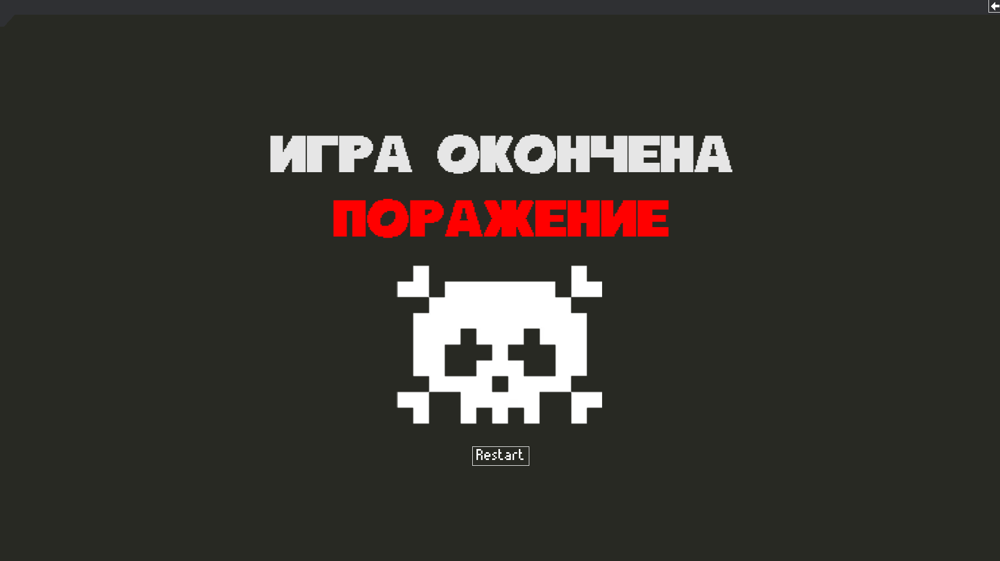
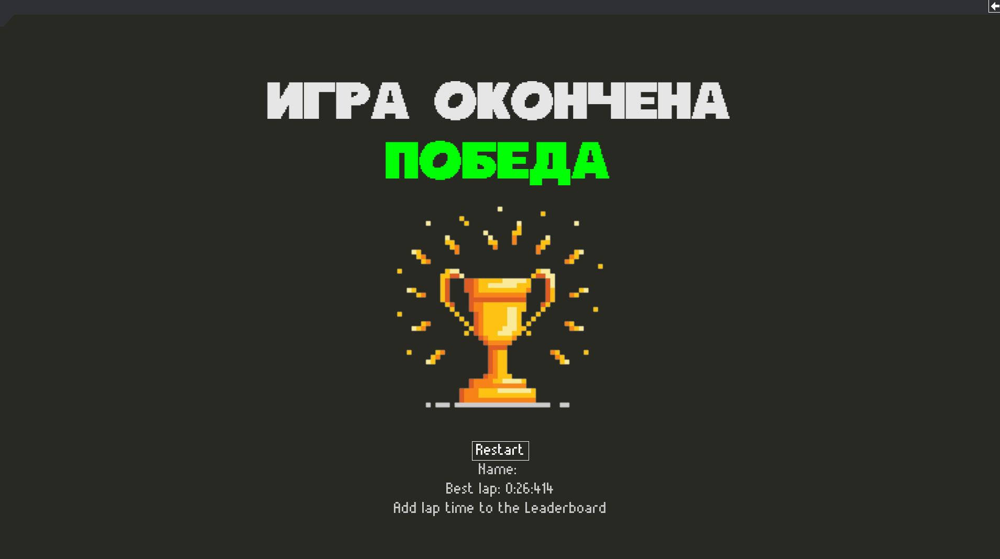

# DreamRace
## О игре:
### Моя игра представляет собой соревновательную гонку с таблицей лидеров. Главной задачей является пройти гоночный круг за наименьшее время.
## Как запустить?
### Распакуйте архив с проектом "DreamRace". Запустите главную форму программы: main.py
## Что присутствует в игре?
### 1. В игре присутствует таблица лидеров и право соревноваться игрокам между собой.
### 2. Есть 4 автомобиля с возможность выбора.
### 3. Выбор количества кругов.
### 4. Приятная физика управления автомобилем и расход топлива.
### 5. Возможность победить или проиграть в гонке.
## Управление в игре:
### Движение:  На стрелочки
### В любом окне меню в правом верхнем углу есть возможность вернуться в главное меню.
## Скриншоты игры:

